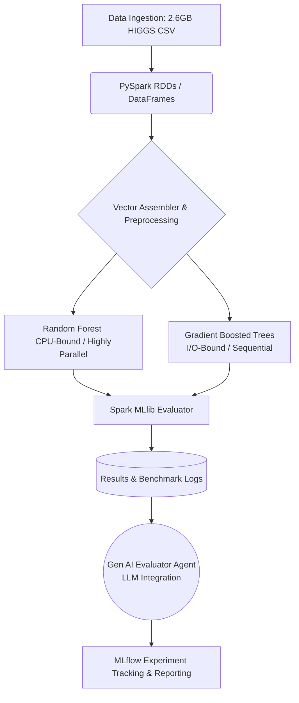

# 🚀 Distributed ML Benchmark: Bagging vs. Boosting & Agentic LLM Evaluation

An enterprise-grade Big Data pipeline built on Apache Spark to benchmark the scalability, network I/O latency, and predictive performance of Random Forest (Bagging) versus Gradient Boosted Trees (Boosting) on the 11-million instance HIGGS dataset. 

This project goes beyond simple accuracy metrics to analyze the distributed systems architecture underlying these algorithms, featuring an autonomous Gen AI (LLM) agent that interprets Spark execution logs to generate executive insights.

## 🏗️ Enterprise Architecture



## 🧠 Theoretical Background: The Distributed Systems Paradigm

In traditional single-machine computing, RAM is the primary bottleneck. However, in distributed clusters (like AWS EMR or Databricks), the bottlenecks shift to **network I/O, serialization overhead, and synchronization latency**. This project evaluates how algorithm design impacts cluster efficiency.

### 1. Bagging (Random Forest): The Parallel Champion
Random Forest utilizes Bootstrap Aggregating. It trains multiple deep, independent decision trees. Because Tree A does not need to communicate with Tree B, Spark can distribute the workload perfectly across 100+ worker nodes. This results in an **"Embarrassingly Parallel"** execution path with minimal network shuffling.

### 2. Boosting (GBT): The Sequential Bottleneck
Gradient Boosted Trees optimize in function space by training shallow trees sequentially. Tree #2 must predict the residual errors of Tree #1. In a distributed environment, this creates a massive synchronization barrier: after *every single tree*, error gradients must be calculated, shuffled across the network, and broadcast to all nodes before the next tree can begin. 

## 📊 Deep-Dive Performance Analysis (100% Data Scale)


<br><br>


<br><br>


<br><br>

The pipeline was tested across 20%, 50%, and 100% data scales to measure exponential latency growth.

| Algorithm | Final Accuracy | Total Training Time | Cluster Resource Profile |
| :--- | :--- | :--- | :--- |
| **Random Forest** | `67.35%` | `1493.62 sec` | **CPU-Bound:** Linear scaling. Highly efficient use of distributed worker nodes. |
| **Gradient Boosting** | `70.52%` | `1764.62 sec` | **I/O-Bound:** Super-linear scaling. Plagued by synchronization network latency. |

### 📈 Results Interpretation & ROI
* **The Accuracy Premium:** GBT squeezed an additional 3.17% accuracy out of the data by iteratively minimizing bias along complex, non-linear decision boundaries inherent in high-energy physics data.
* **The Parallelism Penalty:** To achieve that 3% accuracy bump, GBT required **~18% more compute time**. In a production cloud environment billing by the second, this network-heavy synchronization translates to significantly higher infrastructure costs. 
* **Conclusion:** For latency-critical or budget-constrained pipelines, RF provides the highest ROI. GBT should be reserved for high-stakes modeling where marginal accuracy equates to massive financial/operational value.

---

## 🤖 Gen AI Integration: Autonomous Log Evaluation

Inspired by modern MLOps, this pipeline features a **Gen AI Analysis Hook**. Instead of manually parsing the PySpark outputs, the pipeline captures the training times, accuracy metrics, and scalability ratios, formatting them into a dynamic prompt. An LLM (Large Language Model) is then invoked to autonomously draft a human-readable executive summary, comparing the theoretical constraints with the empirical data.

## 🚀 Advanced Roadmap & Future Scaling

To further harden this pipeline for enterprise deployments, the following architectures are scoped for future iterations:

* **☁️ Cloud & Databricks Migration:** Moving from local PySpark execution to a managed **Databricks workspace** utilizing the Databricks CLI and deploying the pipeline onto an **AWS EMR (Elastic MapReduce)** cluster.
* **🌊 PySpark Structured Streaming:** Transitioning from batch ingestion of the HIGGS dataset to a real-time Kafka stream, evaluating how RF and GBT handle micro-batch inference latency under load.
* **🧠 Large-Scale Deep Learning Integration:** Introducing a **Distributed PyTorch** node to the benchmark to compare traditional ensemble methods against modern neural network architectures.

## 💻 Enterprise Tech Stack

* **Distributed Framework:** Apache Spark (PySpark 4.0.2), MapReduce Paradigms
* **Machine Learning:** PySpark MLlib (Ensemble Methods)
* **MLOps & Governance:** MLflow (Autonomous Experiment Tracking & Parameter Logging)
* **DevOps & Containerization:** Docker (Isolated Environment Execution)
* **Generative AI:** LLM Prompt Engineering for Agentic Reporting
* **Data Manipulation & Visualization:** Pandas, Matplotlib, Mermaid.js

## 💻 Quickstart

**Option A: Standard Execution**
```bash
git clone [https://github.com/amjad-hanini/Spark-Ensemble-ML-Benchmark.git](https://github.com/amjad-hanini/Spark-Ensemble-ML-Benchmark.git)
cd Spark-Ensemble-ML-Benchmark
pip install -r requirements.txt
python benchmark.py
```
*To view the MLflow MLOps dashboard, run `mlflow ui` in your terminal after execution and navigate to `http://localhost:5000`.*

**Option B: Docker Containerized Execution**
*(Requires Docker to be installed. Bypasses the need to install Spark/Java locally).*
```bash
docker build -t spark-ml-benchmark .
docker run spark-ml-benchmark
```

## 📚 Core Literature & Acknowledgements

The theoretical framework, MLOps architecture, and distributed computing paradigms evaluated in this benchmark are grounded in the following foundational computer science literature:

* **Dataset Origin:** Baldi, P., Sadowski, P., & Whiteson, D. (2014). "Searching for exotic particles in high-energy physics with deep learning." *Nature Communications*, 5(1), 4308.
* **MLOps / MLflow Architecture:** Zaharia, M., Chen, A., Davidson, A., Ghodsi, A., Hong, S. A., Konwinski, A., ... & Wendell, P. (2018). "Accelerating the Machine Learning Lifecycle with MLflow." *IEEE Data Eng. Bull.*, 41(4), 39-45.
* **Parallel Random Forest:** Chen, J., Li, K., Tang, Z., Bilal, K., Yu, S., Weng, C., & Li, K. (2017). "A parallel random forest algorithm for big data in a spark cloud computing environment." *IEEE Transactions on Parallel and Distributed Systems, 28*(4), 919-933.
* **Gradient Boosting Mechanics:** Chen, T., & Guestrin, C. (2016). "XGBoost: A Scalable Tree Boosting System." *Proceedings of the 22nd ACM SIGKDD*.
* **Framework Documentation:** [Apache Spark MLlib Official Guide](https://spark.apache.org/docs/latest/ml-guide.html).

## 👨‍💻 Author

**Amjad Hanini**
* GitHub: [@amjad-hanini](https://github.com/amjad-hanini)
